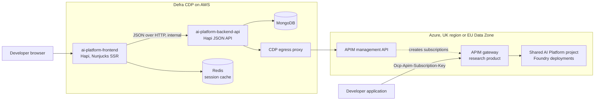
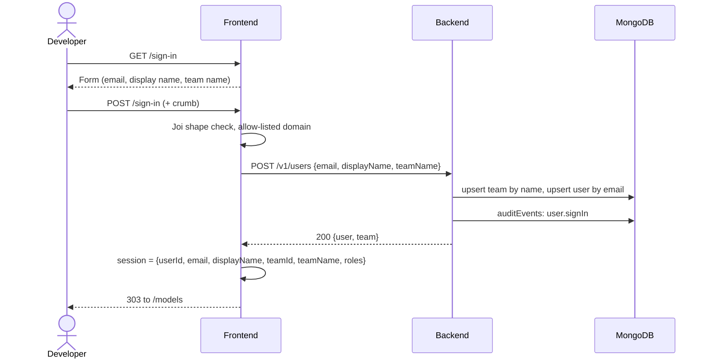
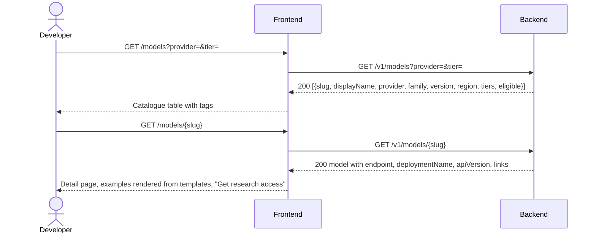
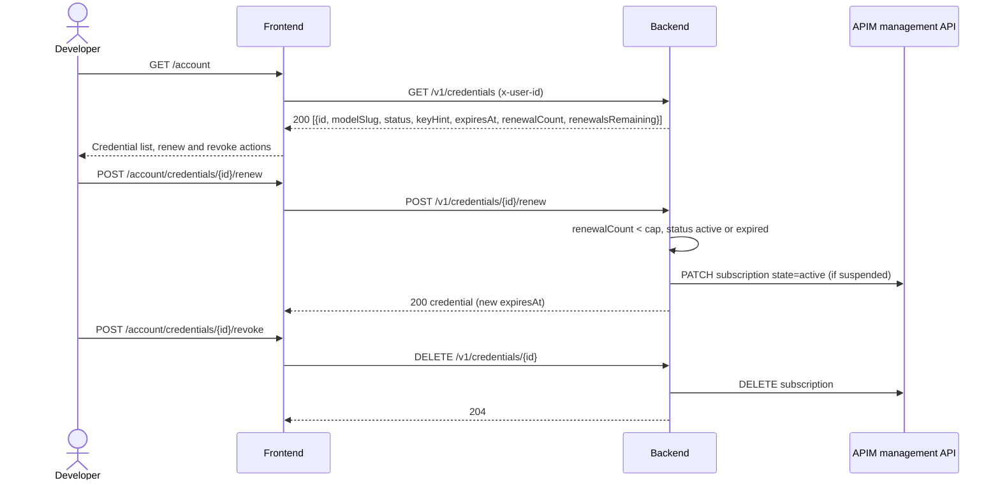
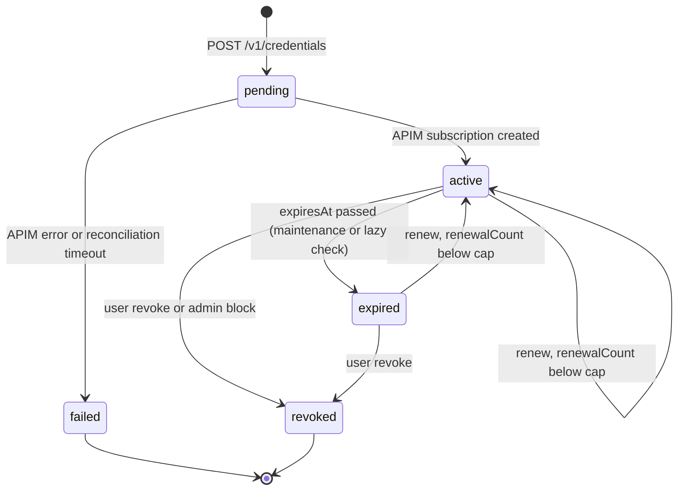

## Purpose and status

This is the build specification for the first slice of the Defra AI Platform Portal: a GOV.UK-styled web UI and a JSON API, delivered as two services on the Defra Core Delivery Platform (CDP). It is written for developers who will implement it PR by PR without access to earlier discovery material. Everything you need is in this document plus the two public CDP templates:

- `https://github.com/DEFRA/cdp-node-frontend-template`
- `https://github.com/DEFRA/cdp-node-backend-template`

Day 1 delivers: sign in, a model catalogue, model detail pages with examples, self-service issue of a rate-limited Research tier credential for a shared model, and an account page to renew or revoke it. It does not deliver Entra sign-in, funded teams, per-team Foundry projects, infrastructure generation or usage dashboards. Those are named follow-on phases.

Platform-level decisions referenced here are proposals except where marked confirmed. Where this slice takes an interim position (for example, subscription keys before OAuth), the deviation is stated and the replacement path is named.

## Background

### Platform facts you need

- AICE is the Defra AI adoption hub. It operates the AI Platform, sets guardrails and issues retirement notices. Delivery teams own their workloads.
- The platform lets Defra applications call eligible, pinned models hosted in Microsoft Azure AI Foundry through an Azure API Management (APIM) gateway. Consumers never receive Azure or Foundry roles, provider keys or direct endpoints.
- Tenancy (confirmed 16 September 2026): one Foundry project per funded team, plus one Shared AI Platform project that hosts the Research tier.
- The Research tier (confirmed 16 September 2026) is free trial access for Defra staff without a funded team. AICE absorbs the cost against its Research cost centre. Rules: Defra tenant identities only (no guests); capture only user and team name; fixed token and time allowances; credentials expire after at most one week; a small fixed number of renewals; users cannot change budgets, limits or models; no production endpoints; the same guardrails as paid tiers (isolation, fixed safety profile, full audit).
- Geography (confirmed): UK regions or the EU Data Zone only. No Global routes, no US Data Zone, no DeepSeek. The platform handles OFFICIAL data only; no OFFICIAL-SENSITIVE.
- Success target to keep in view (proposal O01): a developer reaches usable model access within 5 minutes of sign-in.

### What the earlier proof of concept showed

A Hapi and Nunjucks proof of concept ("Defra AI Portal") validated the journey: choose a provider, choose a model, confirm, then receive an APIM subscription key shown once alongside the endpoint, deployment name, rate limit and a curl example. It used multi-step journeys with short-lived state cookies, CSRF protection on every form, GOV.UK error summaries, and a cached Azure token provider. Reuse the journey shape and these patterns. Do not reuse the code: it targeted Azure hosting, Jest and Winston, and had no user identity.

### Open platform decisions this slice must respect

| ID  | Topic                                       | Position this slice takes                                                                                                         |
| --- | ------------------------------------------- | --------------------------------------------------------------------------------------------------------------------------------- |
| D01 | Gateway tier (open)                         | Target the APIM management REST API, which is the same across SKUs. Do not depend on SKU-specific features.                       |
| D02 | Model and API eligibility (open)            | Catalogue carries an `eligible` flag and UK/EU region data. Only eligible models are offered.                                     |
| D04 | CDP onboarding (open)                       | Team capture is name-only for attribution. No CDP team lookup on day 1.                                                           |
| D05 | Identity and access (proposal, OAuth-first) | Interim: self-declared sign-in and APIM subscription keys behind a `CredentialIssuer` port. Entra OIDC and OAuth issuance follow. |
| D08 | State, diagnostics, retention (open)        | Store audit events without payloads or secrets. No usage or conversation capture.                                                 |

## Scope

### In scope for day 1

| Capability       | Detail                                                                                                            |
| ---------------- | ----------------------------------------------------------------------------------------------------------------- |
| Sign in          | Self-declared form: Defra email on an allow-listed domain, display name, team name. Server session.               |
| Catalogue        | List eligible models with provider, family, version, region and tier tags. Filter by provider and tier.           |
| Model detail     | Facts, use cases, best-practice links, and curl, Python and JavaScript examples rendered for that model.          |
| Research access  | Check-your-answers page, then issue one APIM subscription key per user on the `research` product. Key shown once. |
| Account          | List own credentials (no secrets), renew within the cap, revoke.                                                  |
| Help and legal   | Quick start, best practice, accessibility statement, privacy notice, cookies.                                     |
| Platform hygiene | `/health`, structured logs, request tracing, audit events, metrics.                                               |
| Quality gates    | 95 percent unit coverage, WCAG 2.2 AA, works without JavaScript, SonarCloud clean.                                |

### Out of scope for day 1

| Follow-on item                                                     | Phase                    |
| ------------------------------------------------------------------ | ------------------------ |
| Entra ID OIDC sign-in (authorisation code with PKCE)               | 1b                       |
| OAuth credential issuance and expiry policy                        | 2 (see follow-on design) |
| Funded teams with billing code and three-character service code    | 2                        |
| Per-team Foundry projects via GitHub App, Bicep and GitHub Actions | 2                        |
| Usage, cost and trace dashboards                                   | 2                        |
| Platform Admin UI: block users or teams, eligibility flags         | 2                        |
| Environment choice (DEV, QA, PREPROD, PROD)                        | 2                        |
| Path B orchestration (agents, tools, search)                       | Later                    |

## Personas and roles

| Role           | Day-1 capability                                                | Later                                               |
| -------------- | --------------------------------------------------------------- | --------------------------------------------------- |
| Research user  | Sign in, browse, obtain and manage one Research tier credential | Upgrade to a funded team keeping the same identity  |
| Team user      | Not available                                                   | Reuse team models and credentials                   |
| Team admin     | Not available                                                   | Rotate and revoke team credentials                  |
| Platform admin | Maintenance endpoint only (expire credentials); no UI           | Block, revoke, eligibility flags, cross-tenant view |

Every user record carries a `roles` array so later roles need no schema change.

## Architecture

### Containers



### Boundary rules

- The browser talks only to the frontend. It never calls Azure, Foundry or the backend directly.
- The frontend renders pages, holds session and journey state, and calls the backend through one `apiClient`. It contains no business rules and no database or Azure access.
- The backend owns all business rules, persistence, Azure integration and audit. It is the only writer to MongoDB.
- Azure calls go through the CDP egress proxy using a service principal held in CDP secrets. Workload identity federation replaces the secret later.
- Rate limiting and quotas are enforced by APIM policy on the `research` product. The portal displays limits; it does not meter usage on day 1.

### Environments

CDP provides `dev`, `test`, `perf-test` and `prod` environments with pipelines, MongoDB, Redis, secrets and proxy per service. Day 1 deploys to `dev` and `test`, each pointing at the Shared AI Platform project's APIM instance for that environment. Platform consumer environments (DEV to PROD) map onto CDP environments in phase 2.

## UI and API orchestration

### Responsibilities

| Concern                   | Frontend                                                   | Backend                                                     |
| ------------------------- | ---------------------------------------------------------- | ----------------------------------------------------------- |
| Rendering                 | Nunjucks, GOV.UK Frontend, no client-side data fetching    | None                                                        |
| Input validation          | Joi for form shape and GOV.UK error messages               | Joi for every request; authoritative                        |
| Business rules            | None                                                       | Allow-listed domains, tier eligibility, renewal cap, expiry |
| Session and journey state | `@hapi/yar` in Redis; 15-minute TTL for check-your-answers | Stateless                                                   |
| CSRF                      | `@hapi/crumb` on every POST                                | Not applicable (internal, header-authenticated)             |
| Azure integration         | None                                                       | `ApimManagementClient` behind `CredentialIssuer`            |
| Persistence               | None                                                       | MongoDB repositories                                        |
| Audit                     | None                                                       | `auditEvents` on sign-in, issue, renew, revoke, expire      |
| Error mapping             | API error body to GOV.UK error summary or error page       | `@hapi/boom` JSON errors                                    |
| Tracing                   | Forwards `x-cdp-request-id`                                | Logs and returns `x-cdp-request-id`                         |

### Service-to-service trust

Day 1: the backend is reachable only inside the CDP network. The frontend `apiClient` sets `x-user-id` from the session on every authenticated call. A backend `requireUser` pre-handler validates the header and loads the user. This is an accepted interim risk: any caller inside the network can assert a user. Phase 1b forwards the Entra access token instead and the same pre-handler validates the JWT against the tenant JWKS. No route handler changes.

### Idempotency and recovery

`POST /v1/credentials` requires an `Idempotency-Key` header (UUID generated by the frontend when the check-your-answers page renders). The backend stores it on the credential record with a unique index per user. A retry with the same key returns the original result without creating a second APIM subscription. A credential is written as `pending` before the APIM call and moved to `active` after it succeeds; a failed call marks it `failed` with a safe reason. A maintenance run reconciles `pending` records older than 10 minutes against APIM.

## User journeys

### J1 Sign in



### J2 Browse the catalogue



### J3 Get research access

```mermaid
sequenceDiagram
  actor U as Developer
  participant FE as Frontend
  participant BE as Backend
  participant AZ as APIM management API
  participant DB as MongoDB
  U->>FE: GET /access/research/check?model={slug}
  FE-->>U: Check your answers (email, team, model, limits, expiry, terms)
  U->>FE: POST /access/research/check (+ crumb)
  FE->>BE: POST /v1/credentials {modelSlug, tier: research} + Idempotency-Key + x-user-id
  BE->>BE: ResearchTierPolicy: eligible model, no active credential, domain allowed
  BE->>DB: insert credential status=pending
  BE->>AZ: PUT subscription (scope=/products/research, ownerless, displayName=user id)
  AZ-->>BE: 201 subscription; POST listSecrets for primaryKey
  BE->>DB: update status=active, apimSubscriptionId, keyHint, expiresAt
  BE->>DB: auditEvents: credential.issue
  BE-->>FE: 201 {credential, secret}
  FE->>FE: store secret in session for one render only
  FE-->>U: 303 to /access/research/credential
  U->>FE: GET /access/research/credential
  FE-->>U: Key shown once, endpoint, deployment, rate limit, expiry, examples
```

### J4 Manage credentials



### Credential states



The account page also shows an allowance state derived from the credential: `available`, `renewal cap reached`, `expired` or `blocked` (admin, phase 2). Token and time allowance exhaustion is signalled by APIM to the calling application, not by the portal.

### Error and edge cases

- Email domain not allow-listed: reject at sign-in with a GOV.UK error summary; no user record created.
- User already holds an active credential for the tier: return 409; the frontend shows the existing credential summary with a revoke-and-reissue route.
- APIM call fails: credential stays `pending` then `failed`; the user sees a safe error page with a retry link. No secret is ever returned for a non-active credential.
- Credential past `expiresAt`: any read marks it `expired` (lazy) and the scheduled maintenance run suspends the APIM subscription.
- Renewal cap reached: 403 with `code: renewal-cap-reached`; the page shows the cap and the upgrade route.
- Session expired mid-journey: redirect to `/sign-in` with a returnTo query; no partial records.

## Page inventory

### Routes

| Route                                               | Method    | Page                     | GOV.UK components                                                            | Data                              |
| --------------------------------------------------- | --------- | ------------------------ | ---------------------------------------------------------------------------- | --------------------------------- |
| `/`                                                 | GET       | Start                    | Start button, inset text                                                     | None                              |
| `/sign-in`                                          | GET, POST | Sign in                  | Text inputs, error summary, button                                           | `POST /v1/users`                  |
| `/sign-out`                                         | POST      | Sign out                 | Button                                                                       | Session clear                     |
| `/models`                                           | GET       | Model catalogue          | Table, tags, radios or select for filters                                    | `GET /v1/models`                  |
| `/models/{slug}`                                    | GET       | Model detail             | Summary list, tabs (curl, Python, JavaScript), details, button               | `GET /v1/models/{slug}`           |
| `/access/research/check`                            | GET, POST | Check your answers       | Summary list with change links, checkbox (terms), warning text, button       | Session + `POST /v1/credentials`  |
| `/access/research/credential`                       | GET       | Your research credential | Panel, warning text, summary list, code blocks, copy button (JS enhancement) | Session (one render)              |
| `/account`                                          | GET       | Your account             | Summary cards, tags, buttons                                                 | `GET /v1/credentials`             |
| `/account/credentials/{id}/renew`                   | POST      | Renew                    | Button, notification banner on return                                        | `POST /v1/credentials/{id}/renew` |
| `/account/credentials/{id}/revoke`                  | GET, POST | Confirm revoke           | Radios (yes, no), button                                                     | `DELETE /v1/credentials/{id}`     |
| `/help`, `/help/quick-start`, `/help/best-practice` | GET       | Help                     | Typography, details                                                          | Static Nunjucks                   |
| `/accessibility-statement`, `/privacy`, `/cookies`  | GET       | Legal                    | Typography                                                                   | Static Nunjucks                   |
| `/health`                                           | GET       | Health                   | None                                                                         | JSON                              |

All routes except `/`, `/sign-in`, `/help*`, legal pages and `/health` require a signed-in session.

### Key screens

The catalogue is a single table: model name (link), provider, family and version, region or data zone, tier tags (`Research`, `Team`), and an eligibility tag. Filters are a form that submits with GET so the page works without JavaScript.

The model detail page opens with a summary list (provider, family, version, context window, region, data zone, tiers, pinned version note), then use cases, then best-practice links (GOV.UK style external links), then example calls in tabs with the endpoint and deployment name filled in and `<your-subscription-key>` as a placeholder. A single primary button, "Get research access", leads to check your answers. If the user already holds an active credential, the button is replaced by a link to the account page.

The credential page follows the proof of concept: a green panel confirming issue, a warning that the key is shown once, the key in a read-only input with a copy button (enhancement only), a summary list (endpoint, deployment name, API version, rate limit, quota, expires on), the same three examples with the real key substituted, and next-step links to quick start, best practice and account.

### Design tokens

- GOV.UK Frontend 6.x with `govukRebrand: true` in the page template.
- `$govuk-brand-colour: #00a33b` (Defra green) for the header bar and start button; links stay GOV.UK blue `#1d70b8`; focus stays `#fd0`.
- Header service name "Defra AI Platform"; phase banner "Alpha" with a feedback link.
- Two-thirds and one-third grid on detail and credential pages; full width for the catalogue table.

## API v1 contract

### Endpoints

All paths are prefixed `/v1` except `/health`. Requests and responses are JSON. Authenticated routes require `x-user-id` (day 1) or a bearer token (phase 1b).

| Method | Path                              | Purpose                                                    | Request                                                   | Success                                                             | Errors                                           |
| ------ | --------------------------------- | ---------------------------------------------------------- | --------------------------------------------------------- | ------------------------------------------------------------------- | ------------------------------------------------ |
| GET    | `/health`                         | Liveness                                                   | None                                                      | 200 `{status: "ok"}`                                                | None                                             |
| POST   | `/users`                          | Upsert user and team at sign-in                            | `{email, displayName, teamName}`                          | 200 or 201 `{user, team}`                                           | 400, 403 domain not allowed                      |
| GET    | `/users/me`                       | Current user and team                                      | Header only                                               | 200 `{user, team}`                                                  | 401, 404                                         |
| GET    | `/models`                         | Eligible catalogue                                         | Query `provider?`, `tier?`                                | 200 `{items: [...]}`                                                | 400                                              |
| GET    | `/models/{slug}`                  | Model detail                                               | Path `slug`                                               | 200 model with `endpoint`, `deploymentName`, `apiVersion`, `limits` | 404                                              |
| POST   | `/credentials`                    | Issue Research tier credential                             | `{modelSlug, tier: "research"}`, header `Idempotency-Key` | 201 `{credential, secret}`; secret only here                        | 400, 403 policy, 409 active exists, 502 upstream |
| GET    | `/credentials`                    | List own credentials                                       | Header only                                               | 200 `{items: [...]}` without secrets                                | 401                                              |
| GET    | `/credentials/{id}`               | One credential                                             | Path `id`                                                 | 200 credential                                                      | 404 (also for other users' ids)                  |
| POST   | `/credentials/{id}/renew`         | Extend expiry within cap                                   | Path `id`                                                 | 200 credential                                                      | 403 `renewal-cap-reached`, 404, 409 revoked, 502 |
| DELETE | `/credentials/{id}`               | Revoke                                                     | Path `id`                                                 | 204                                                                 | 404, 502                                         |
| POST   | `/maintenance/expire-credentials` | Expire and suspend past-due credentials, reconcile pending | Header `x-maintenance-token`                              | 200 `{expired, suspended, reconciled}`                              | 401                                              |

Joi schemas: `email` lowercase, max 254, domain in allow-list; `displayName` 1 to 100; `teamName` 1 to 100; `modelSlug` pattern `^[a-z0-9-]+$`; `Idempotency-Key` UUID v4.

### Error format

Errors use `@hapi/boom` with a stable `code` for the frontend to map:

```json
{
  "statusCode": 403,
  "error": "Forbidden",
  "message": "You have used all renewals for this credential.",
  "code": "renewal-cap-reached",
  "requestId": "a1b2c3"
}
```

Codes: `validation`, `domain-not-allowed`, `model-not-eligible`, `active-credential-exists`, `renewal-cap-reached`, `credential-revoked`, `upstream-unavailable`, `not-found`.

## Domain model and MongoDB collections

Field names are camelCase. Timestamps are ISO 8601 UTC. `_id` is an ObjectId.

| Collection    | Fields                                                                                                                                                                                                                                                                                                                 | Indexes                                                                |
| ------------- | ---------------------------------------------------------------------------------------------------------------------------------------------------------------------------------------------------------------------------------------------------------------------------------------------------------------------- | ---------------------------------------------------------------------- |
| `users`       | `email` (lowercased), `displayName`, `teamId`, `roles` (array, default `["research-user"]`), `createdAt`, `updatedAt`, `lastSignInAt`                                                                                                                                                                                  | unique `email`                                                         |
| `teams`       | `name`, `normalisedName`, `serviceCode` (null day 1), `billingCode` (null day 1), `createdBy`, `createdAt`                                                                                                                                                                                                             | unique `normalisedName`                                                |
| `models`      | `slug`, `displayName`, `provider`, `family`, `version`, `deploymentName`, `apiVersion`, `apimPath`, `region`, `dataZone`, `eligible`, `tiers` (array), `description`, `useCases` (array), `contextWindow`, `links` (array of `{text, href}`), `limits` `{requestsPerMinute, tokensPerDay}`, `seedVersion`, `updatedAt` | unique `slug`; `eligible, provider`                                    |
| `credentials` | `userId`, `teamId`, `modelSlug`, `tier`, `type` (`apim-subscription`), `apimSubscriptionId`, `keyHint` (last 4), `status` (`pending`, `active`, `expired`, `revoked`, `failed`), `idempotencyKey`, `createdAt`, `activatedAt`, `expiresAt`, `renewalCount`, `revokedAt`, `revokedReason`, `failureReason`              | unique `userId, idempotencyKey`; `userId, status`; `status, expiresAt` |
| `auditEvents` | `at`, `actorUserId`, `action` (`user.signIn`, `credential.issue`, `credential.renew`, `credential.revoke`, `credential.expire`), `resource`, `resourceId`, `outcome`, `code`, `requestId`                                                                                                                              | `actorUserId, at`; TTL on `at` per retention decision (D08)            |

Never store the subscription key, a token, or request or response payloads. `keyHint` is display-only.

### Catalogue source options

| Option               | Pros                                                                                                                      | Cons                                                                         |
| -------------------- | ------------------------------------------------------------------------------------------------------------------------- | ---------------------------------------------------------------------------- |
| Curated seed only    | Reviewed content, deterministic tests, no Azure call on read                                                              | Drift from real deployments; manual updates                                  |
| Live from Azure only | Always current                                                                                                            | Slow, coupled to Azure availability, no room for curated copy or eligibility |
| Hybrid (chosen)      | Curated copy and eligibility from seed; deployment status and version enriched live behind a flag with cache and fallback | Two sources to reason about; enrichment needs a reader role                  |

Day 1 ships the seed path only. `FEATURE_LIVE_CATALOGUE=false` by default. The seed is a versioned JSON file in the backend repository, applied idempotently on start-up by `seedVersion`.

## Backend structure

Start from `cdp-node-backend-template` (Node 24, ES modules, Hapi 21, convict, hapi-pino, MongoDB driver, mongo-locks, Joi, Boom, vitest, neostandard, prettier, SonarCloud). Add nothing outside this list without review.

```text
src/
  api/
    users/        routes.js, controller.js          thin: validate, call one service, map result
    models/
    credentials/
    maintenance/
    health/
  domain/
    research-tier-policy.js                          ttlDays, renewalCap, allowedDomains, canIssue(), canRenew()
    credential.js                                     state transitions
    errors.js                                         domain errors with codes
  services/
    user-service.js                                   upsert user and team, audit
    catalogue-service.js                              read models, optional live enrichment, cache
    credential-service.js                             issue, renew, revoke, expire, reconcile
  repositories/
    users.js  teams.js  models.js  credentials.js  audit-events.js
  adapters/
    azure/
      token-provider.js                               client credentials, in-memory cache, single in-flight refresh
      apim-management-client.js                       create, get, listSecrets, patchState, delete subscription
      apim-subscription-issuer.js                       implements CredentialIssuer
    credential-issuer.js                              port: issue(), renew(), revoke(), suspend()
  common/
    config/  logging/  mongodb/  seed/  plugins/
```

Rules: controllers never touch repositories or adapters; services own rules and transactions; adapters carry no business logic; dependencies are injected through a `server.app` container at start-up so tests substitute fakes without module mocking; every exported function has JSDoc.

APIM calls (management API version 2024-05-01): `PUT .../subscriptions/{id}` with `properties.scope = /products/{researchProductId}`, `displayName = user id`, `state = active`; `POST .../subscriptions/{id}/listSecrets` for the primary key; `PATCH` state to `suspended` on expiry; `DELETE` on revoke. Set `expirationDate` for audit only, because APIM does not enforce it. The subscription id is deterministic (`research-{userId}-{credentialId}`) so retries are safe.

## Frontend structure

Start from `cdp-node-frontend-template` (Hapi 21, Vision and Nunjucks, GOV.UK Frontend 6, Vite and sass-embedded, yar with catbox-redis, blankie CSP, scooter, inert, hapi-pino, vitest, cheerio). Add `@hapi/crumb`.

```text
src/
  server/
    home/  sign-in/  models/  access/  account/  help/  legal/  health/
      index.js (plugin)  routes.js  controller.js  views/*.njk
    common/
      templates/layouts/page.njk                      header, phase banner, footer, crumb, rebrand
      components/                                     model-table, credential-card, code-examples macros
      helpers/api-client.js                           fetch wrapper: base URL, x-user-id, x-cdp-request-id, timeouts, error mapping
      helpers/session.js                              get and set typed session values
      helpers/require-sign-in.js                      pre-handler redirecting to /sign-in
      helpers/errors.js                                API error to view model
  client/
    javascripts/application.js                        GOV.UK init, copy-to-clipboard enhancement
    stylesheets/application.scss                      brand colour override, rebrand
  config/index.js                                     convict
```

Every page renders fully server-side. JavaScript adds only the copy button and GOV.UK component behaviours.

## Cross-cutting requirements

### Security

- CSP through blankie: `default-src 'self'`, `frame-ancestors 'none'`, no inline scripts; HSTS and `X-Content-Type-Options` from the template's secure-context plugin.
- CSRF: crumb token on every frontend POST.
- Validation: Joi on every frontend form and every backend route; reject unknown keys.
- Secrets: the subscription key exists in memory for one response and one render. It is never logged, persisted or included in audit events.
- Logging: no personal data, no keys, no tokens. Log user ids, not emails.
- Sessions: `httpOnly`, `secure`, `SameSite=Lax`, Redis-backed, 8-hour absolute lifetime.
- Backend has no public ingress; maintenance route requires `x-maintenance-token` from CDP secrets.

### Observability

- hapi-pino with ECS JSON format; every log line carries `x-cdp-request-id`.
- `@defra/hapi-tracing` propagates the request id from frontend to backend.
- `@defra/cdp-metrics` counters: `credential_issued`, `credential_renewed`, `credential_revoked`, `credential_failed`, `apim_call_duration`.
- `auditEvents` written for every state-changing action with outcome and code.

### Accessibility

- WCAG 2.2 AA using GOV.UK Design System patterns only.
- Error summary with links to fields; one H1 per page; page titles prefixed with "Error: " on validation failure.
- All journeys complete with JavaScript disabled and by keyboard.
- Interactive targets at least 24 by 24 CSS pixels; forced-colours mode checked.
- Code examples in `<pre><code>` with a visible language label.

### Configuration

All configuration is read through convict from environment variables. CDP injects secrets and MongoDB and Redis settings.

| Service  | Variable                                                            | Purpose                                               |
| -------- | ------------------------------------------------------------------- | ----------------------------------------------------- |
| Frontend | `API_BASE_URL`                                                      | Internal backend URL                                  |
| Frontend | `ALLOWED_EMAIL_DOMAINS`                                             | Comma-separated Defra domains for sign-in             |
| Frontend | `SESSION_CACHE_ENGINE`, `REDIS_*`                                   | Session store (template defaults)                     |
| Backend  | `MONGO_URI`, `MONGO_DATABASE`                                       | CDP MongoDB (template defaults)                       |
| Backend  | `AZURE_TENANT_ID`, `AZURE_CLIENT_ID`, `AZURE_CLIENT_SECRET`         | Service principal (secret from CDP secrets)           |
| Backend  | `AZURE_SUBSCRIPTION_ID`, `APIM_RESOURCE_GROUP`, `APIM_SERVICE_NAME` | APIM management target                                |
| Backend  | `APIM_RESEARCH_PRODUCT_ID`, `APIM_GATEWAY_BASE_URL`                 | Research product and public gateway host for examples |
| Backend  | `RESEARCH_CREDENTIAL_TTL_DAYS=7`, `RESEARCH_RENEWAL_CAP=3`          | Research tier policy                                  |
| Backend  | `ALLOWED_EMAIL_DOMAINS`                                             | Authoritative copy of the allow-list                  |
| Backend  | `FEATURE_LIVE_CATALOGUE=false`, `CATALOGUE_SEED_PATH`               | Catalogue behaviour                                   |
| Backend  | `MAINTENANCE_TOKEN`                                                 | Guards the maintenance route                          |
| Both     | `NODE_USE_ENV_PROXY=1`, `HTTPS_PROXY`                               | Set by CDP                                            |

## Testing strategy

| Layer       | Tool                                                  | Scope                                                                                         |
| ----------- | ----------------------------------------------------- | --------------------------------------------------------------------------------------------- |
| Unit        | vitest, `server.inject`                               | Controllers with fake services; services with fake repositories and issuer; policy rules      |
| Adapter     | vitest-fetch-mock                                     | Token provider caching, APIM client requests and error mapping                                |
| Integration | vitest-mongodb (backend); mocked API (frontend)       | Repositories and full route flows; frontend journeys with cheerio assertions                  |
| Contract    | Shared JSON fixtures                                  | Same example payloads copied into both repositories' `test/fixtures`; no shared package day 1 |
| Journey     | CDP journey test suite (Playwright)                   | J1 to J4 end to end in `dev`; axe accessibility checks; follow-on repository                  |
| Static      | eslint (neostandard), prettier, stylelint, SonarCloud | Every PR                                                                                      |

Coverage thresholds in `vitest.config.js`: statements, lines and functions 95 percent; branches 90 percent. Builds fail below threshold.

### Definition of done

- Lint, format and tests pass locally and in CI; coverage thresholds met; SonarCloud quality gate green.
- No new dependency outside the two templates plus `@hapi/crumb` without a note in the PR.
- Every new route has a happy-path and a validation-failure test.
- Every page passes an axe scan and a manual keyboard and no-JavaScript check.
- No secrets, emails or payloads in logs (assert in tests with a log spy).
- README updated for any new environment variable.

## Delivery phases

Frontend and backend proceed in parallel from the contract above. Each phase is one or more PRs per repository.

| Phase | Backend                                                                  | Frontend                                                                         | Depends on                              |
| ----- | ------------------------------------------------------------------------ | -------------------------------------------------------------------------------- | --------------------------------------- |
| P0    | Scaffold from template, `/health`, config, CI, Sonar, README             | Scaffold, layout with rebrand and Defra colour, start page, help and legal pages | CDP repositories created                |
| P1    | `models` repository, seed, `GET /v1/models`, `GET /v1/models/{slug}`     | Catalogue and model detail pages with example templates                          | P0                                      |
| P2    | `users`, `teams`, `POST /v1/users`, `GET /v1/users/me`, audit            | Sign-in form, session, `requireSignIn`, sign out                                 | P0                                      |
| P3    | Token provider, APIM client, issuer, `POST /v1/credentials`, idempotency | Check your answers, credential page, one-render secret handling                  | P1, P2, research product exists in APIM |
| P4    | List, renew, revoke, maintenance expire and reconcile                    | Account page, renew, revoke confirmation                                         | P3                                      |
| P5    | Hardening: rate limits on API, log assertions, retention TTL             | Accessibility audit, CSP tightening, journey tests, docs                         | P4                                      |

## Follow-on design: OAuth credential issuance and expiry

The platform direction is OAuth-first with keys only where a supported flow requires them. Day 1 uses APIM subscription keys because they exist today and the proof of concept validated them. The `CredentialIssuer` port isolates this choice. The next design must answer:

- Client registration unit: one Entra app registration per user, per team, or per application, and who creates it.
- Grant type for deployed applications (client credentials) versus developer tooling (device code or authorisation code).
- Token lifetime and refresh policy per tier: Research tier at most one week; production longer but finite.
- Revocation propagation window across issued tokens, APIM caches and active requests.
- APIM policy shape: `validate-jwt` or `validate-azure-ad-token` with audience and claim checks, mapped to the research product limits.
- How `POST /v1/credentials` returns a client id and secret or a certificate, and how `renew` maps to secret rotation.
- Migration of existing subscription-key credentials and the user-facing message.

## Risks and assumptions

| Item                                                                               | Type       | Mitigation                                                                                    |
| ---------------------------------------------------------------------------------- | ---------- | --------------------------------------------------------------------------------------------- |
| Gateway SKU not selected (D01)                                                     | Risk       | Use only management API features common to all SKUs; keep issuer behind a port                |
| CDP egress proxy must allow `management.azure.com` and `login.microsoftonline.com` | Assumption | Request allow-list entries when creating the repositories                                     |
| Service principal secret is an interim credential                                  | Risk       | Store in CDP secrets; plan workload identity federation                                       |
| APIM does not enforce subscription expiry                                          | Fact       | Backend sets `expiresAt`, lazy-expires on read, and a scheduled run suspends the subscription |
| Research product rate-limit and quota policy lives in platform IaC                 | Dependency | Portal displays limits from the seed; confirm values with the platform team                   |
| Self-declared identity can be spoofed                                              | Accepted   | Internal network only; Research tier is free and dev-only; Entra follows in 1b                |
| Only OFFICIAL data                                                                 | Constraint | State in privacy notice and model detail pages                                                |

## Glossary

| Term                       | Meaning                                                                                                         |
| -------------------------- | --------------------------------------------------------------------------------------------------------------- |
| AICE                       | Defra AI adoption hub that operates the AI Platform                                                             |
| APIM                       | Azure API Management, the gateway in front of models; also its management REST API                              |
| CDP                        | Defra Core Delivery Platform on AWS: repositories, pipelines, MongoDB, Redis, secrets, proxy                    |
| Credential                 | A platform-issued secret that lets an application call a model through APIM                                     |
| Foundry                    | Microsoft Azure AI Foundry, the model provider                                                                  |
| Idempotency-Key            | Client-generated UUID that makes a create request safe to retry                                                 |
| Pinned model               | A specific model version selected by the consumer; the platform never auto-upgrades it                          |
| Research tier              | Free, AICE-funded, dev-only access on the Shared AI Platform project with fixed limits and one-week credentials |
| Service code               | Three-character team identifier used for attribution and billing (phase 2)                                      |
| Shared AI Platform project | The single Foundry project hosting shared deployments for the Research tier                                     |
