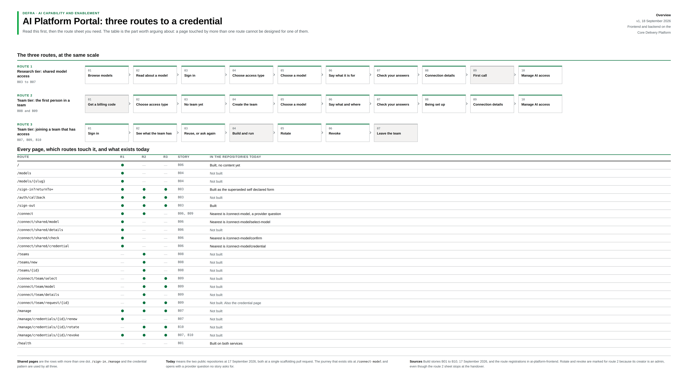
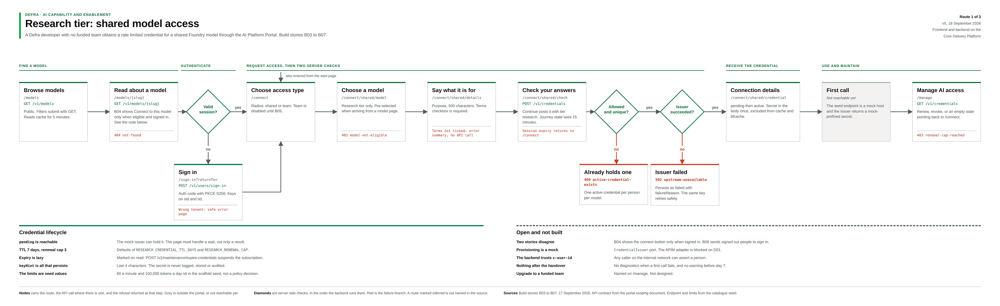
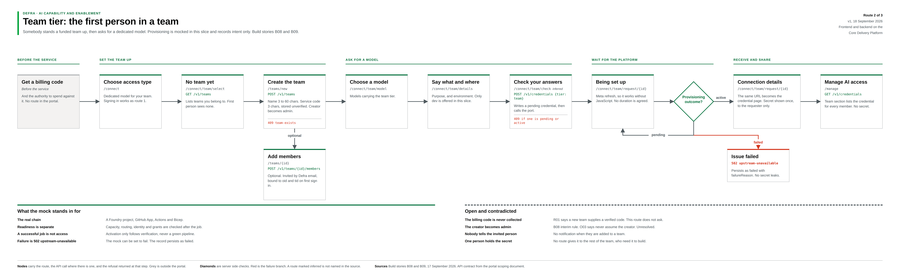
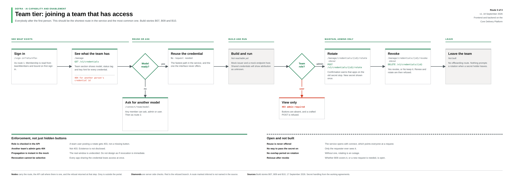

## Purpose

The source diagrams for this journey ("UI Flow - three routes to a credential") were authored as a
set of images in a personal OneDrive folder, not in any git repository. This page captures the
authoritative content of those diagrams in text, with the original images copied alongside it, so
it survives a fresh clone of the platform repos.

This is the FINALIZED user journey superseding earlier assumed routes (e.g. old `/connect-model/*`
and `/account` frontend routes are REPLACED by `/connect/*` and `/manage`). For the backend
orchestration model referenced throughout (GitOps vs Direct API paths), see
[design-orchestration.md](../../ai-platform-discovery-docs/src/content/design-orchestration.md)
(area C) in `ai-platform-discovery-docs`. For how this journey was actually built, see
[docs/plans/route0-welcome-plan.md](plans/route0-welcome-plan.md),
[route1-plan.md](plans/route1-plan.md), [route2-plan.md](plans/route2-plan.md) and
[route3-plan.md](plans/route3-plan.md).

## Overview: three routes at a glance

- **Route 1** (Research tier: shared model access, B03-B07), 10 steps: Browse models -> Read about a model -> Sign in -> Choose access type -> Choose a model -> Say what it is for -> Check your answers -> Connection details -> First call (greyed/not built) -> Manage AI access.
- **Route 2** (Team tier: first person in a team, B08-B09), 10 steps: Get a billing code (greyed, outside portal) -> Choose access type -> No team yet -> Create the team -> Choose a model -> Say what and where -> Check your answers -> Being set up -> Connection details -> Manage AI access.
- **Route 3** (Team tier: joining a team that has access, B07/B09/B10), 7 steps: Sign in -> See what the team has -> Reuse, or ask again -> Build and run (greyed) -> Rotate (greyed) -> Revoke (greyed) -> Leave the team (greyed).

## Authoritative page/route table

"Every page, which routes touch it, what existed at 17 September 2026" (R1/R2/R3 = dot means that
route touches this page; Story = build story reference).

| Route path                            | R1  | R2  | R3  | Story    | State at 17 Sept 2026                             |
| ------------------------------------- | --- | --- | --- | -------- | ------------------------------------------------- |
| `/`                                   | •   |     |     | B06      | Built, no content yet                             |
| `/models`                             | •   |     |     | B04      | Not built                                         |
| `/models/{slug}`                      | •   |     |     | B04      | Not built                                         |
| `/sign-in?returnTo=`                  | •   | •   | •   | B03      | Built as the superseded self-declared form        |
| `/auth/callback`                      | •   | •   | •   | B03      | Not built                                         |
| `/sign-out`                           | •   | •   | •   | B03      | Built                                             |
| `/connect`                            | •   | •   |     | B06, B09 | Nearest was `/connect-model`, a provider question |
| `/connect/shared/model`               | •   |     |     | B06      | Nearest was `/connect-model/select-model`         |
| `/connect/shared/details`             | •   |     |     | B06      | Not built                                         |
| `/connect/shared/check`               | •   |     |     | B06      | Nearest was `/connect-model/confirm`              |
| `/connect/shared/credential`          | •   |     |     | B06      | Nearest was `/connect-model/credential`           |
| `/teams`                              |     | •   |     | B08      | Not built                                         |
| `/teams/new`                          |     | •   |     | B08      | Not built                                         |
| `/teams/{id}`                         |     | •   |     | B08      | Not built                                         |
| `/connect/team/select`                |     | •   | •   | B09      | Not built                                         |
| `/connect/team/model`                 |     | •   | •   | B09      | Not built                                         |
| `/connect/team/details`               |     | •   |     | B09      | Not built                                         |
| `/connect/team/request/{teamId}/{id}` |     | •   | •   | B09      | Built. Polling wait page                          |
| `/connect/team/credential`            |     | •   | •   | B09      | Built. Final credential page (secret shown once)  |
| `/manage`                             | •   | •   | •   | B07      | Not built                                         |
| `/manage/credentials/{id}/renew`      | •   |     |     | B07      | Not built                                         |
| `/manage/credentials/{id}/rotate`     |     | •   | •   | B10      | Not built                                         |
| `/manage/credentials/{id}/revoke`     | •   | •   | •   | B07, B10 | Not built                                         |
| `/health`                             |     |     |     | B01      | Built on both services                            |

Footnotes:

- Shared pages are rows with more than one dot: `/sign-in`, `/manage` and the credential pattern are used by all three routes.
- Sources: build stories B01-B10 (17 September 2026) and route registrations in `ai-platform-frontend`. Rotate and revoke are marked for Route 2 because its creator is an admin, even though the Route 2 sheet stops at the handover.

**Key takeaway: this table is the single source of truth for the route paths that were implemented/renamed.** It confirmed: `/connect-model/*` had to be replaced by `/connect/*` (split into `/connect/shared/*` and `/connect/team/*`); `/account` had to be replaced/renamed to `/manage`; the `/models` catalogue wasn't built; `/auth/callback` (OIDC callback) wasn't built yet (the sign-in flow in place at the time was not proper OIDC).

## Route 1: research tier — shared model access

Build stories B03 to B07. A Defra developer with no funded team obtains a rate-limited credential
for a shared Foundry model through the AI Platform Portal.

Flow sections: FIND A MODEL -> AUTHENTICATE -> REQUEST ACCESS (2 server checks) -> RECEIVE CREDENTIAL -> USE AND MAINTAIN

1. Browse models - `/models`, `GET /v1/models`. Public. Filters submit with GET. Reads cache 5 min.
2. Read about a model - `/models/{slug}`, `GET /v1/models/{slug}`. B04: shows "Connect to this model" only when eligible AND signed in. Error: `404 not-found`.
3. Diamond "Valid session?" -> yes: Choose access type. no: Sign in.
   - Sign in - `/sign-in?returnTo=`, `POST /v1/users/sign-in`. Auth code + PKCE S256. Keys on `oid` and `tid`. Wrong tenant -> safe error page. Returns back to Choose access type.
4. Choose access type - `/connect`. Radios: shared or team. Team disabled until B09. (also entered directly from start page)
5. Choose a model - `/connect/shared/model`. Research tier only. Pre-selected if arriving from a model page. Error: `403 model-not-eligible`.
6. Say what it is for - `/connect/shared/details`. Purpose textarea 500 chars. Terms checkbox required (terms not ticked -> error summary, no API call).
7. Check your answers - `/connect/shared/check`, `POST /v1/credentials`. Posts with tier=research. Session expiry mid-journey returns to `/connect`.
8. Diamond "Allowed and unique?" -> no: "Already holds one" `409 active-credential-exists` (one active credential per person per model). yes -> next diamond.
9. Diamond "Issuer succeeded?" -> no: "Issuer failed" `502 upstream-unavailable`, persists as failed with `failureReason`; same idempotency key retries safely. yes -> Connection details.
10. Connection details - `/connect/shared/credential`. Status pending then active. Secret shown in body ONCE, excluded from cache and bfcache.
11. First call - (grey/not reachable yet, outside portal) - mock host seed endpoint, issuer returns mock-prefixed secret.
12. Manage AI access - `/manage`, `GET /v1/credentials`. Renew, revoke, or empty state pointing back to `/connect`. Error: `403 renewal-cap-reached`.

Credential lifecycle notes: pending is reachable (mock issuer can hold it; page must handle a wait
state, not just a result); TTL 7 days, renewal cap 3 (`RESEARCH_CREDENTIAL_TTL_DAYS`,
`RESEARCH_RENEWAL_CAP`); expiry is lazy (marked on read; `POST /v1/maintenance/expire-credentials`
suspends the subscription); `keyHint` is all that persists (last 4 chars; secret never
logged/stored/audited); rate limits (60/min, 100,000 tokens/day) sit in scaffold seed, not a policy
decision.

Known gaps flagged on the diagram itself: two stories disagreed (B04 showed the connect button only
when signed in; B06 sent signed-out people to sign in — resolved by the Route 1 follow-up plan
making browsing and `GET /connect` public); provisioning is a mock (`CredentialIssuer` port, APIM
adapter blocked on D01); the backend trusts `x-user-id` (any caller on the internal network can
assert a person); nothing after handover (no diagnostics if the first call fails, no warning before
day-7 expiry); upgrade to a funded team is named on `/manage` but wasn't designed.

## Route 2: team tier — the first person in a team

Build stories B08 and B09. Somebody stands a funded team up, then asks for a dedicated model.
Provisioning is mocked in this slice and records intent only.

Flow sections: BEFORE THE SERVICE -> SET THE TEAM UP -> ASK FOR A MODEL -> WAIT FOR THE PLATFORM -> RECEIVE AND SHARE

1. Get a billing code - (before the service, grey/outside portal) - and the authority to spend against it. No route in the portal.
2. Choose access type - `/connect`. Dedicated model for your team. Signing in works as Route 1 (session check reused).
3. No team yet - `/connect/team/select`, `GET /v1/teams`. Lists teams you belong to. First person sees none.
4. Create the team - `/teams/new`, `POST /v1/teams`. Name 3-60 chars. Service code 3 chars, stored unverified. Creator becomes admin. Error: `409 team-exists`.
   - optional branch down to: Add members - `/teams/{id}`, `POST /v1/teams/{id}/members`. Optional. Invited by Defra email, bound to oid and tid on first sign-in.
5. Choose a model - `/connect/team/model`. Models carrying the team tier.
6. Say what and where - `/connect/team/details`. Purpose, and environment. Only "dev" offered in this slice.
7. Check your answers - `/connect/team/check`, `POST /v1/credentials {tier: team}`. Writes a pending credential, then calls the port. Error: `409 if one is pending or active`.
8. Being set up - `/connect/team/request/{teamId}/{id}`. Meta refresh so it works without JavaScript. No duration is agreed.
9. Diamond "Provisioning outcome?" -> pending: loops back to Being set up. active -> Connection details. failed -> Issue failed.
10. Connection details - `/connect/team/credential`, redirected to from the wait page once the deployment is `active`. Secret shown once, to the requester only.
11. Issue failed - `502 upstream-unavailable`. Persists as failed with failureReason. No secret leaks.
12. Manage AI access - `/manage`, `GET /v1/credentials`. Team section lists the credential for every member. No secret.

What the mock stands in for: the real chain (a Foundry project, GitHub App, Actions and Bicep);
readiness checked separately (capacity, routing, identity and grants checked after the job); a
successful job is not access (activation only follows verification, never a green pipeline);
failure is `502 upstream-unavailable` (the mock can be set to fail; the record persists as failed).

Known gaps: the billing code is never collected (an earlier requirement said a new team supplies a
verified code; this route doesn't ask); the creator becomes admin (interim rule, "never assume the
creator" was flagged as unresolved); nobody tells the invited person (no notification when added to
a team); one person holds the secret (no route gives it to the rest of the team, who need it to
build).

## Route 3: team tier — joining a team that has access

Build stories B07, B09 and B10. Everybody after the first person — should be the shortest route in
the service and the most common one.

Flow sections: SEE WHAT EXISTS -> REUSE OR ASK -> BUILD AND RUN -> MAINTAIN, ADMINS ONLY -> LEAVE

1. Sign in - `/sign-in?returnTo=`. As Route 1. Membership read from `teamMembers`, bound on first sign-in.
2. See what the team has - `/manage`, `GET /v1/credentials`. Team section shows model, status tag, key hint for every credential. Error: `404 for another person's credential id`.
3. Diamond "Model ready?" -> yes: Reuse the credential. no: Ask for another model.
4. Reuse the credential - no request needed. Fastest path in the service; the one the interface never offers (the UI doesn't surface a shortcut to it).
5. Ask for another model - `/connect/team/model`. Any member can ask, admin or user. Then follows Route 2's flow.
6. Build and run - not reachable yet (grey/mock). Mock issuer and mock endpoint host. Shared credentials show attribution as unknown.
7. Diamond "Team role?" -> admin: Rotate/Revoke (maintain section). user (red branch): View only.
8. View only - `403 admin-required`. Buttons absent; a crafted POST is refused.
9. Rotate (admin) - `/manage/credentials/{id}/rotate`, `POST /v1/credentials/{id}/rotate`. Confirmation warns apps using old secret stop; new secret shown once.
10. Revoke (admin) - `/manage/credentials/{id}/revoke`, `DELETE /v1/credentials/{id}`. Yes revoke or No keep it. Renew and rotate then refused.
11. Leave the team - not built. No offboarding route. Nothing prompts rotation when a secret holder leaves.

Enforcement notes (role checked in the API, not just hidden buttons): a team user posting a rotate
gets 403, not a missing button; another team's admin gets 404 on a credential id, not 403 (existence
not disclosed); propagation is instant in the mock (real revocation window is undecided, don't
design as if immediate); revocation cannot be selective (every app sharing the credential loses
access at once).

Known gaps: reuse is never offered in the UI (the service opens with `/connect`, which points
everyone at a new request); no way to pass the secret on (only the requester ever sees it); no
overlap period on rotation (without one, rotating is an outage); whether B09 covers reissue after
revoke, or a new request is needed, was left open.

## Cross-cutting route naming (supersedes earlier assumptions)

- Model catalogue: `/models`, `/models/{slug}` (public, GET only).
- Sign in: `/sign-in?returnTo=` (not `/auth/sign-in` or similar).
- Access-type chooser: `/connect` (replaces the old `/connect-model` root).
- Shared/research sub-flow: `/connect/shared/model`, `/connect/shared/details`, `/connect/shared/check`, `/connect/shared/credential`.
- Team sub-flow: `/connect/team/select`, `/teams/new`, `/teams/{id}` (add members), `/connect/team/model`, `/connect/team/details`, `/connect/team/request/{teamId}/{id}` (the "being set up" polling page), `/connect/team/credential` (the final credential page).
- Manage/account area: `/manage` (not `/account`), `GET /v1/credentials`; admin actions `/manage/credentials/{id}/rotate` and `/manage/credentials/{id}/revoke`.
- Backend surface added: `GET /v1/teams`, `POST /v1/teams`, `POST /v1/teams/{id}/members`, `POST /v1/credentials {tier: team}` (extends the existing issue endpoint), `POST /v1/credentials/{id}/rotate` (rotate is distinct from renew), team role checks (403 admin-required for non-admins doing rotate/revoke), 404 (not 403) when accessing another team's credential by id.
- Mongo collections added: `teams`, `teamMembers` (or embedded in teams); `credentials` gained a `tier` field (research/team), `teamId`, attribution fields.
